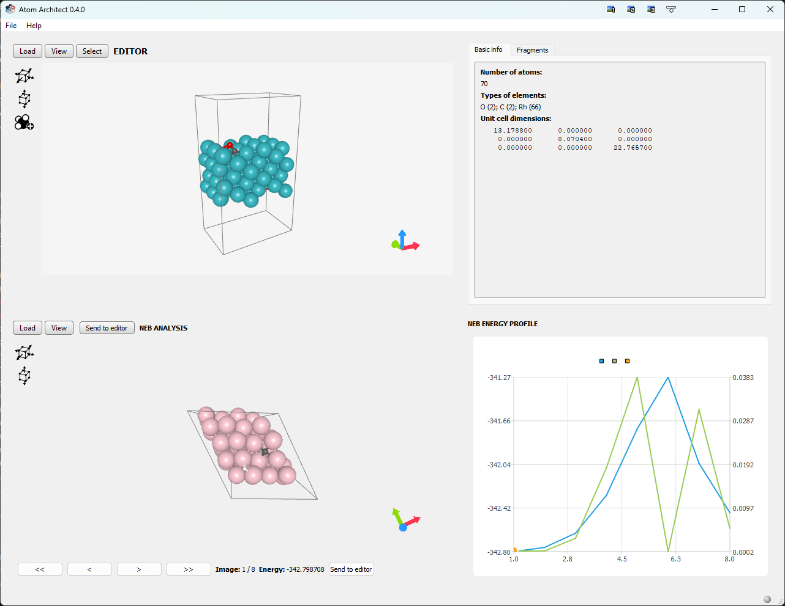

# Atom Architect


[](https://github.com/ifilot/atom-architect/actions/workflows/windows.yml)
[](https://github.com/ifilot/atom-architect/actions/workflows/linux.yml)
[](https://www.gnu.org/licenses/gpl-3.0)



## Purpose
Atom Architect is a VASP visualization and structure building tool. Its unique
feature is that atom placement is conducted in a relative fashion, i.e. with
respect to the existing atomic structure. This is especially useful for
catalysis purposes where atoms are typically placed at e.g. bridge, threefold or
fourfold sites.

## Downloads

Latest installer for Window: [here](https://github.com/ifilot/atom-architect/releases/latest/download/atom-architect-installer-win64.exe)

## Compilation

### Windows

Compilation for Windows is most easily done by installing Qt Creator and loading
the project file `atom-architect.pro`.

### Linux Debian / Ubuntu

### Qt5

Start by installing all the required dependencies

```bash
sudo apt update && sudo apt install -y \
qtbase5-dev \
libqt5charts5-dev \
libgl1-mesa-dev \
build-essential \
libglm-dev \
libeigen3-dev \
cmake
```

Create a new build folder, go to this folder, create the compilation and start
the compilation.

```bash
mkdir build
cd build
cmake ../
make -j
```

This will generate the compilation scripts and compile Atom Architect. You can
use Atom Architect by running `./atom_architect` in your `build` folder. If
you wish to install Atom Architect on your system, you can run in your `build`
folder the following command.

```bash
sudo cp -v ./atom_architect /usr/local/bin/atom_architect
```

### Snellius

To compile for the Snellius infrastructure, it is recommended to use the Qt5
toolchain. 

```bash
module load 2023 Qt5/5.15.10-GCCcore-12.3.0
```

and apply the patch

```bash
patch -p1 CMakeLists.txt < qt5.patch
```

Next, compilation is fairly straightforward.

```bash
mkdir build
cd build
cmake ../
make -j
```

## Common problems

> I have troubles running `Atom Architect` remotely via MobaXterm.

Try to enable direct rendering by setting the following environmental variable:

```bash
export LIBGL_ALWAYS_INDIRECT=0
```