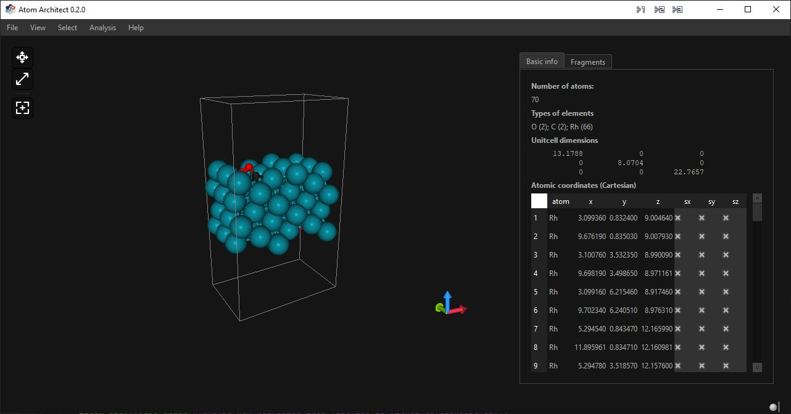

# Atom Architect

## Purpose
Atom Architect is a VASP visualization and structure building tool. Its unique
feature is that atom placement is conducted in a relative fashion, i.e. with
respect to the existing atomic structure. This is especially useful for
catalysis purposes where atoms are typically placed at e.g. bridge, threefold or
fourfold sites.

## Downloads

Latest installer for Window: [here](https://github.com/ifilot/atom-architect/releases/latest/download/atom-architect-installer-win64.exe)

## Compilation
